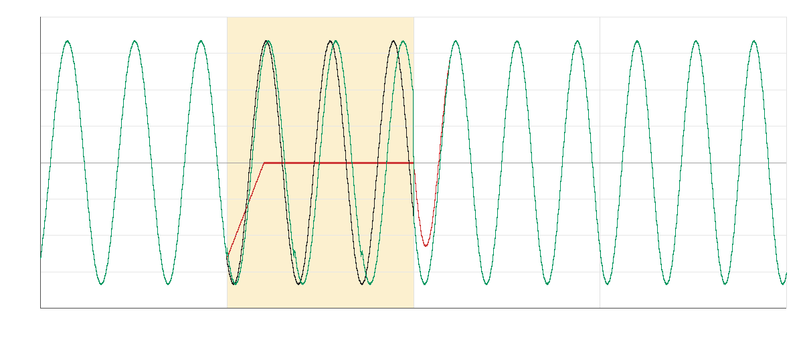
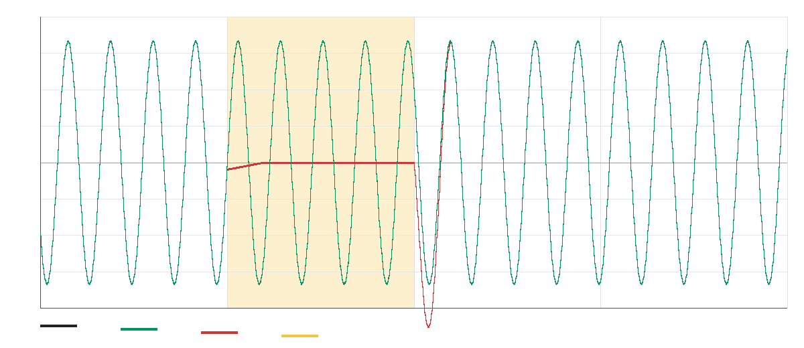

# PLC Comparison Notes

These measurements compare packet-loss concealment modes using the same deterministic
loopback scenario:

```sh
./cmake-build-debug/udp_audio_loopback 50 20 25 1337 0 recordings/plc_none.wav none
./cmake-build-debug/udp_audio_loopback 50 20 25 1337 0 recordings/plc_repeat.wav repeat
./cmake-build-debug/udp_audio_loopback 50 20 25 1337 0 recordings/plc_periodic.wav periodic
./cmake-build-debug/udp_audio_loopback 50 20 25 1337 0 recordings/plc_periodic_interp.wav periodic_interp
```

Baseline:

```sh
./cmake-build-debug/udp_audio_loopback 50 0 0 1337 0 recordings/clean_50.wav periodic_interp
```

## Test Signal

- 440 Hz sine wave
- 48 kHz mono float PCM
- 10 ms engine frames
- 50 total frames
- 20% deterministic packet loss
- Up to 25 ms deterministic delivery jitter
- Seed: 1337

## Results

| Mode | Peak | RMS Error vs Clean | Max Error vs Clean | Max Adjacent Delta |
|---|---:|---:|---:|---:|
| none | 0.273106 | 0.051334 | 0.296620 | 0.013519 |
| repeat | 0.394134 | 0.098304 | 0.552830 | 0.015555 |
| periodic | 0.200000 | 0.000771 | 0.005236 | 0.012560 |
| periodic_interp | 0.200000 | 0.000021 | 0.000152 | 0.011565 |

## Interpretation

- `none` exposes the missing-frame problem directly: the stream drops to silence.
- `repeat` confirms that naive frame repetition can be worse than silence for this signal,
  because phase mismatch plus boundary correction can create large overshoot.
- `periodic` estimates the recent waveform period and continues from one whole-sample
  period ago, which keeps the concealed signal close to the clean sine wave.
- `periodic_interp` uses the same period estimate but refines it with fractional-sample
  interpolation. For this 440 Hz test tone, that matters because the true period at
  48 kHz is about 109.09 samples, not an integer.

The current best mode is `periodic_interp`.

## Changing Pitch Check

The loopback demo also supports a `chirp` source:

```sh
./cmake-build-debug/udp_audio_loopback 50 0 0 1337 0 recordings/chirp_clean_50.wav periodic_interp chirp
./cmake-build-debug/udp_audio_loopback 50 20 25 1337 0 recordings/chirp_none.wav none chirp
./cmake-build-debug/udp_audio_loopback 50 20 25 1337 0 recordings/chirp_repeat.wav repeat chirp
./cmake-build-debug/udp_audio_loopback 50 20 25 1337 0 recordings/chirp_periodic.wav periodic chirp
./cmake-build-debug/udp_audio_loopback 50 20 25 1337 0 recordings/chirp_periodic_interp.wav periodic_interp chirp
```

This sweeps from 220 Hz to 880 Hz over the 50-frame run. It is still synthetic, but it
is harder than the steady sine wave because the expected period changes during a lost
packet.

| Mode | Peak | RMS Error vs Clean | Max Error vs Clean | Max Adjacent Delta |
|---|---:|---:|---:|---:|
| none | 0.343722 | 0.051531 | 0.322695 | 0.024803 |
| repeat | 0.459466 | 0.074044 | 0.628483 | 0.026474 |
| periodic | 0.200000 | 0.027555 | 0.220224 | 0.207200 |
| periodic_interp | 0.200000 | 0.024291 | 0.194438 | 0.201478 |

`periodic_interp` still has the lowest RMS and max error of the PLC modes, but it no
longer disappears. The largest adjacent-sample jump happens at the resume boundary
after a concealed frame, where the synthesized pitch has drifted away from the real
incoming chirp.

For the `periodic_interp` chirp run, concealed frame sequences were again
`5, 13, 29, 32, 40, 48`. Per-frame RMS error during those concealed blocks ranged from
about `0.065` to `0.079`, and the largest resume-boundary jump was about `0.201`.



This is a useful failure mode: the PLC is synthesizing plausible audio during the loss,
but the handoff back to real audio needs a smarter transition.

## Activation Check

`periodic_interp` sounds unusually clean on the sine-wave test, so it was verified
against a fresh deterministic run:

```sh
./cmake-build-debug/udp_audio_loopback 50 20 25 1337 0 recordings/check_periodic_interp.wav periodic_interp
```

That run reported:

- `concealed=6`
- `jitter_underruns=6`
- `missing_frames=6`
- `plc_mode=periodic_interp`
- Concealed frame sequences: `5, 13, 29, 32, 40, 48`

Each concealed frame in the recorded WAV contained 480 nonzero samples, so the output
was synthesized PLC audio rather than silence or an accidentally bypassed clean frame.
For the concealed frames, the per-frame RMS error versus the clean reference was about
`0.00006`, with max absolute error around `0.00015`.



The highlighted frame in the waveform is a missing 10 ms packet. The `periodic_interp`
output stays nearly on top of the clean sine wave, while `none` visibly collapses toward
silence and creates a discontinuity at the resume boundary.

This result is credible because the test signal is a stable 440 Hz sine wave, which is
an ideal case for periodic packet-loss concealment. Speech, music, transients, noise,
and changing pitch will be harder; the goal there is not perfect reconstruction but a
concealment that avoids sharp discontinuities and sounds plausibly continuous.
